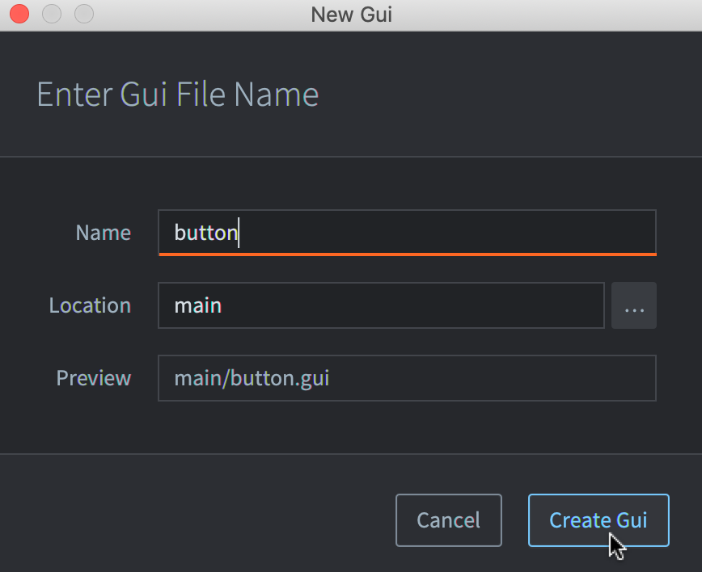
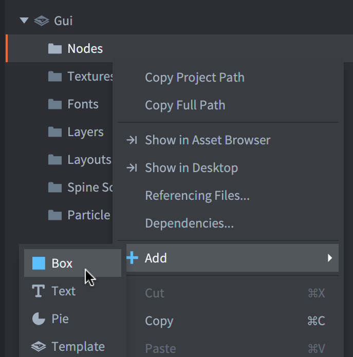
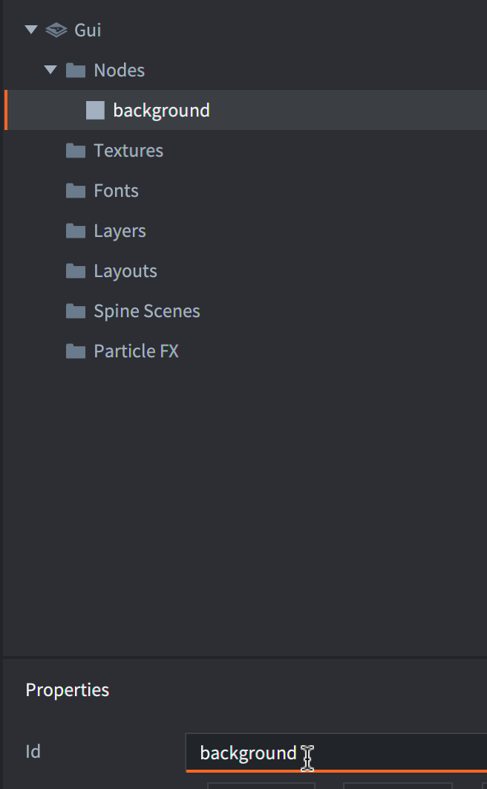
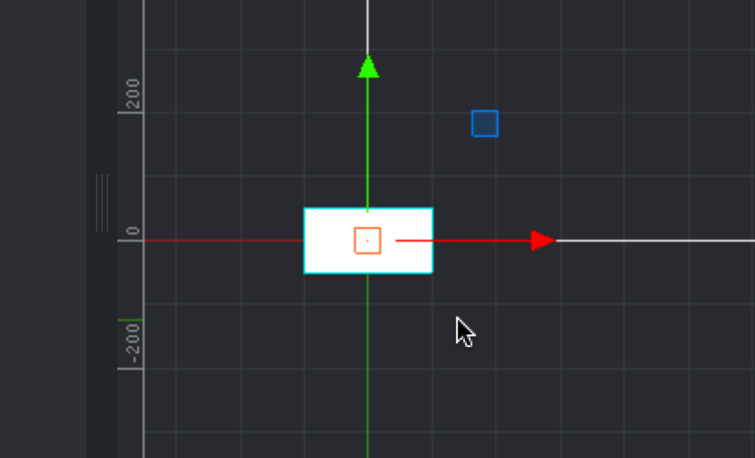
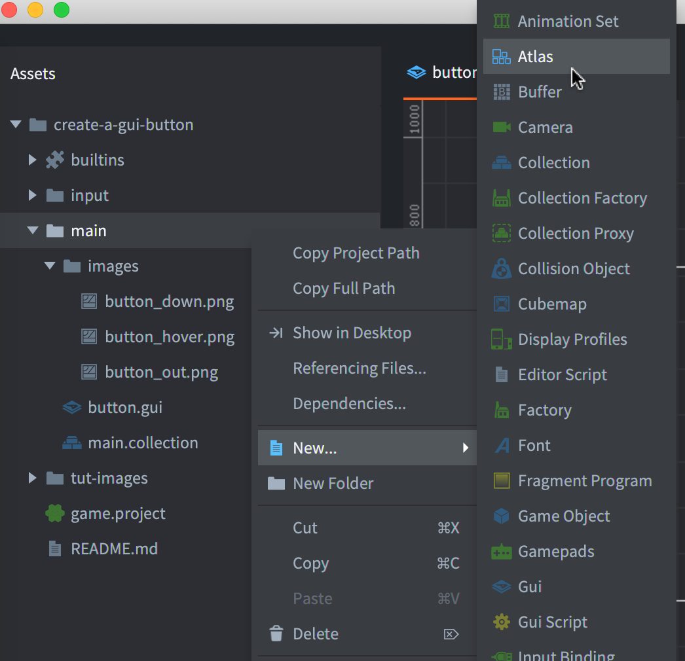
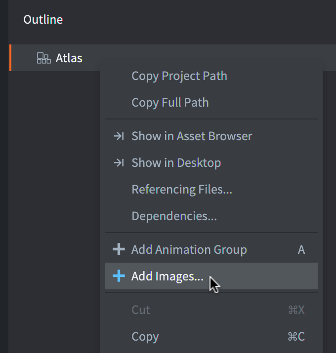
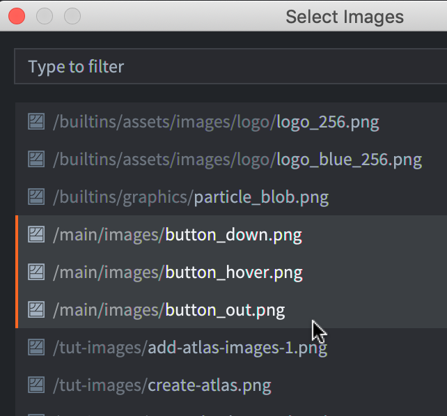
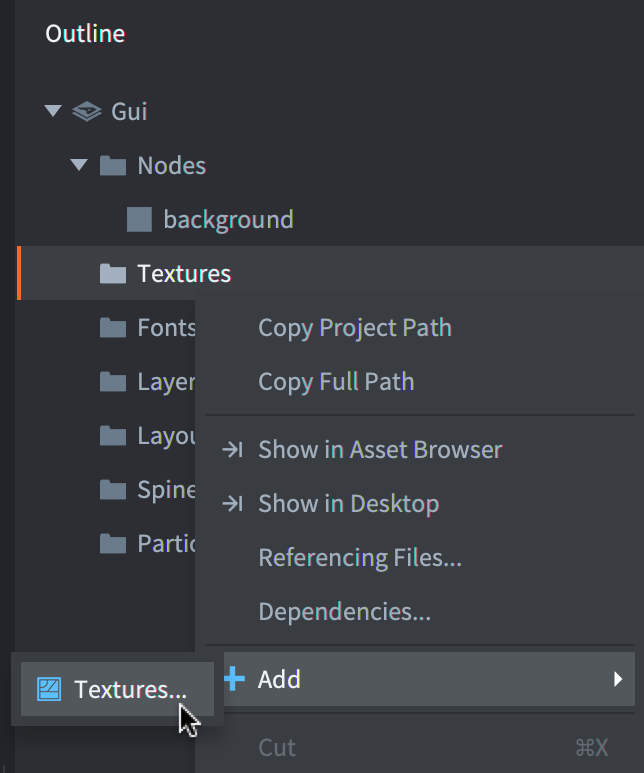
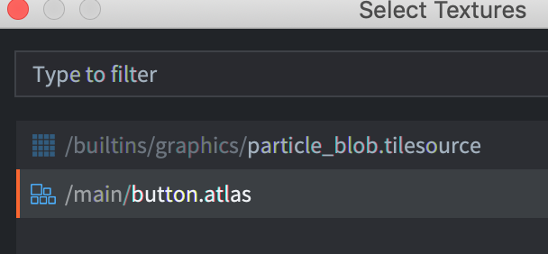

# Create a GUI button

Button! Proof of civilization! At a press of button, many precious things were given birth and destroyed, especially an indie dev's hopes and dreams. So how can we create button with hxDefold?

First by creating a GUI component (we can also create buttons using game object but let's leave it for another day). Right click the `main` folder, select `New...` > `Gui`. Let's name it `button`.

Then we create a box node to display the background image of our button. Open `button.gui`, on the right panel of the screen, right click `Nodes` > `Add` > `Box`,name it `background`.

Cool, we created a white box! Let's make it cooler! Download the 3 images below which are a part of [Kenney's UI Pack](https://www.kenney.nl/assets/ui-pack).

- `button_out.png` is for the default state when the mouse / touch is outside of our button.

- `button_hover.png` is for when the mouse cursor is hovering over our button but not pressed down.

- And `button_down.png` for when the touch / mouse button is pressing down.

Let's but them into `main/images`. Now to create an [atlas](https://defold.com/manuals/atlas/) from them, right click on `main`, select `New...` > `Atlas` and name it `button`.

Open `button.atlas` we just created, on the right panel of the screen, right click `Atlas` > `Add Images...` then select the 3 images for our button and click `Okay`.

Now back to our `button.gui`. Right click `Textures` > `Add` > `Textures...`, select our `button.atlas`.

