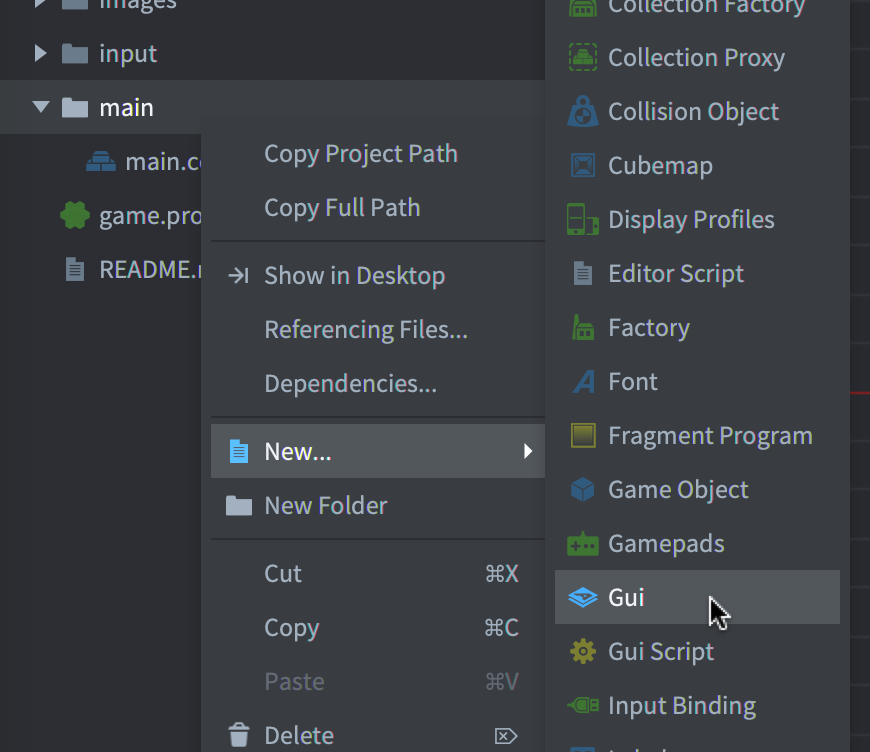

# Create a button in GUI

Buttons! Proof of civilization! At a press of a button, many things were given birth and destroyed, especially an indie dev's hopes and dreams. So how can we create buttons with hxDefold? First by creating a GUI component named `button` (we can also create buttons using game objects but let's leave it for another day).

Right click the `main` folder, select `New...` > `Gui`. 

Then we create a box node named `button` in the GUI component.

Good now let's switch to Haxe and create a GUI script and fetch the `button` node.

