# Create a GUI button

Button! Proof of civilization! At a press of button, many things were given birth and destroyed, especially an indie dev's hopes and dreams. So how can we create button with [hxDefold](https://github.com/hxdefold/hxdefold)?

Let's start by creating an empty Defold project. Then we create a GUI component (we can also create buttons using game objects but let's leave it for another day). Right click the `main` folder, select `New...` > `Gui`, name it `button`.

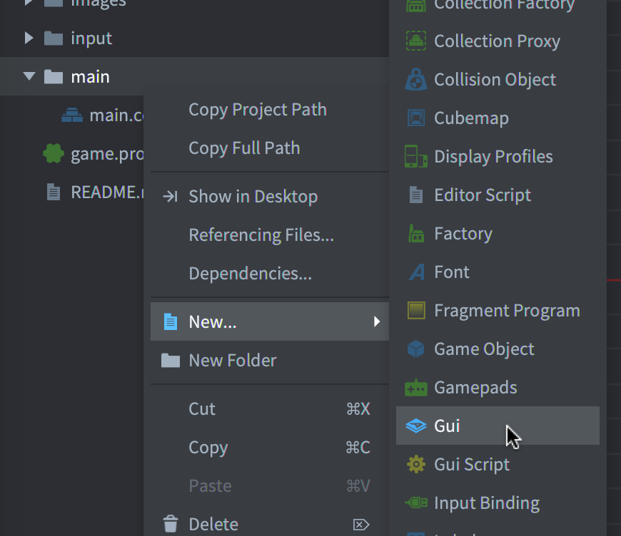

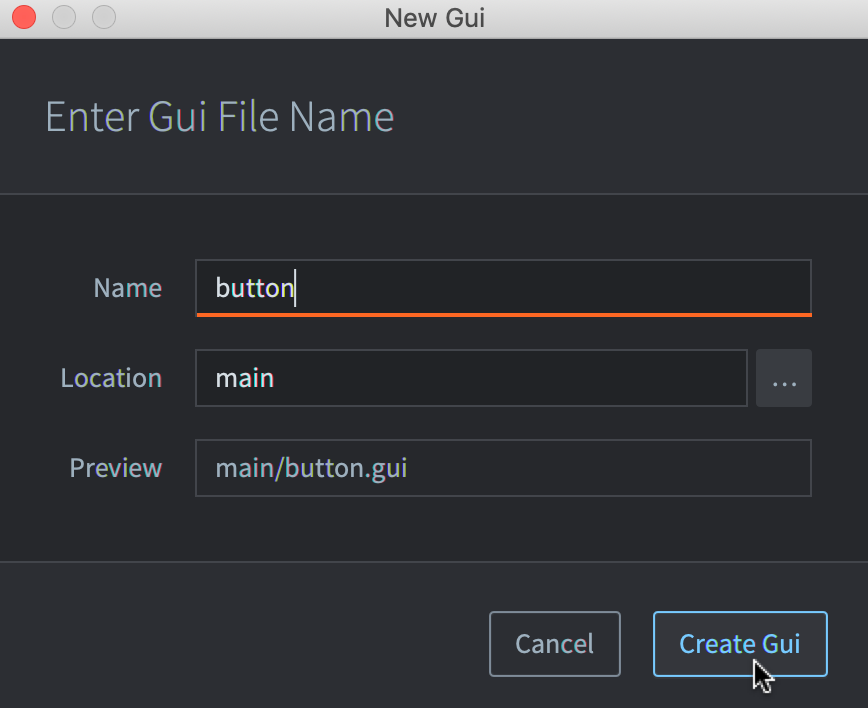

Next we create a box node to display the background image of our button. Open `button.gui`, on the right panel of the screen, right click `Nodes` > `Add` > `Box`, name it `background`.


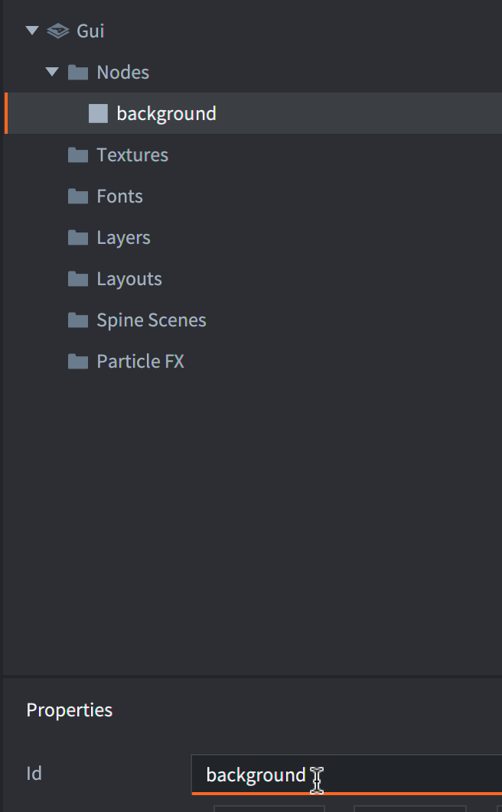


Cool, we created a white box! Let's make it cooler! Save the 3 images below, they are a part of [Kenney's UI Pack](https://www.kenney.nl/assets/ui-pack).

- `out.png` is for the default state when the mouse / touch is outside of our button.


- `hover.png` is for when the mouse cursor is hovering over our button but not pressing down.


- And `button_down.png` for when the touch / mouse button is pressing down.


Let's put them into `main/button_images`. Now to create an [atlas](https://defold.com/manuals/atlas/) from them, right click on `main`, select `New...` > `Atlas` and name it `button`.

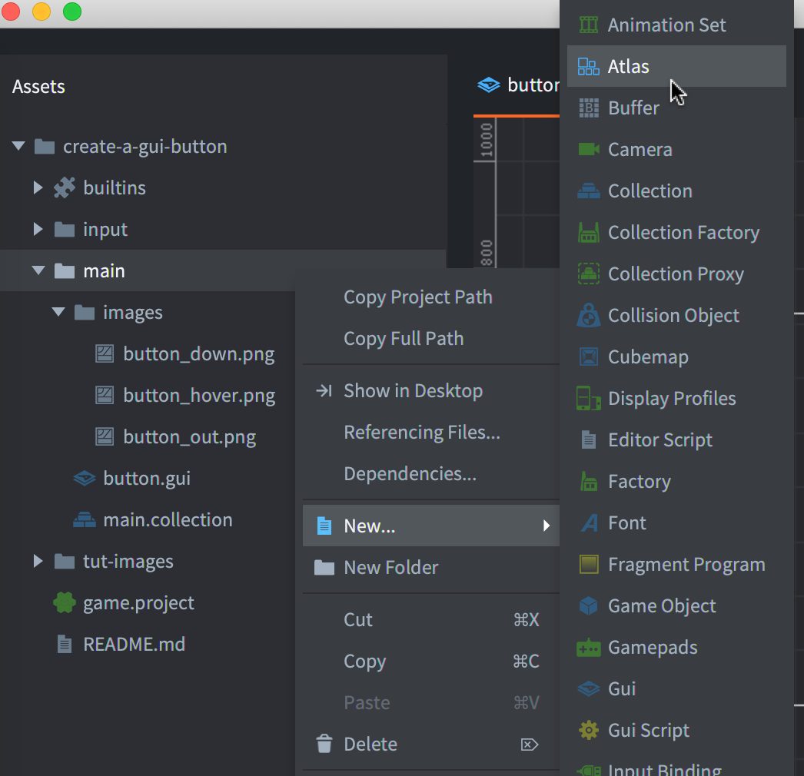

Open the `button.atlas` file we just created, on the right panel of the screen, right click `Atlas` > `Add Images...` then select the 3 images for our button and click `Okay`.

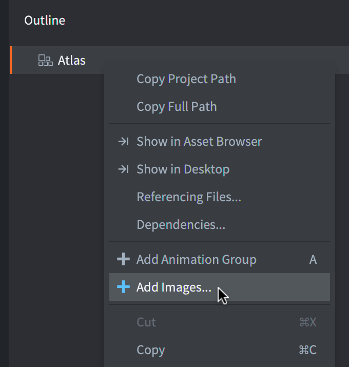

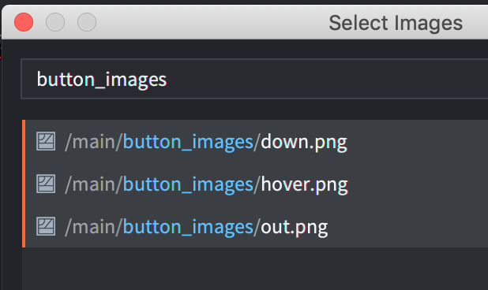

Now back to `button.gui`, right click `Textures` > `Add` > `Textures...`, select `button.atlas`.

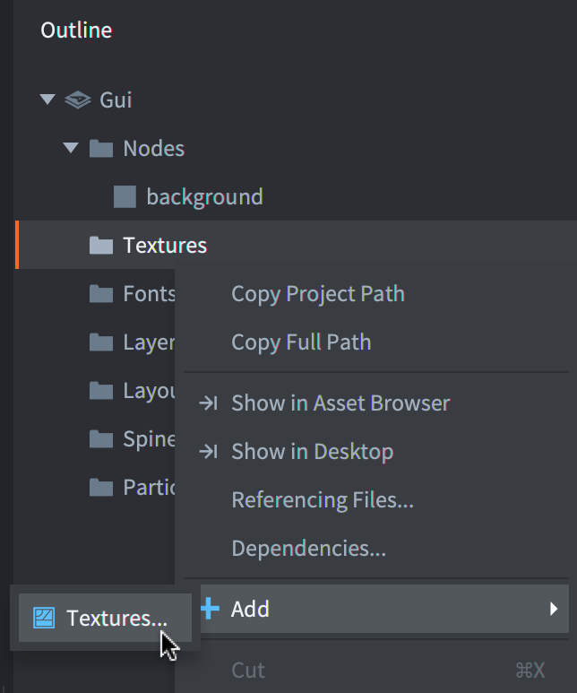

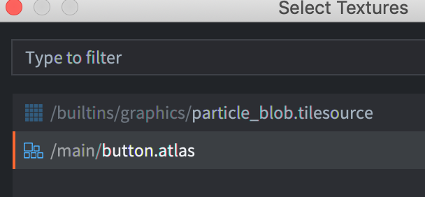

We can finally turn our `background` box node into a cool `background` box node by setting its `Texture` to `button/out` which is the default button state.

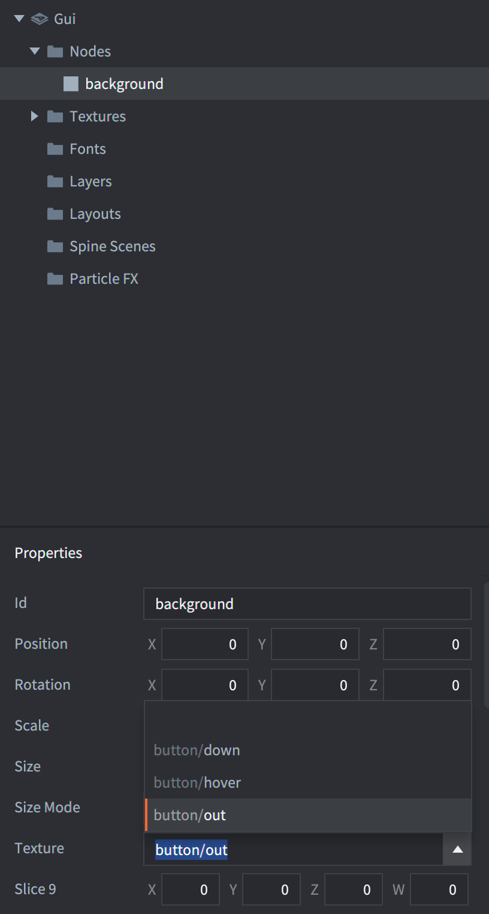

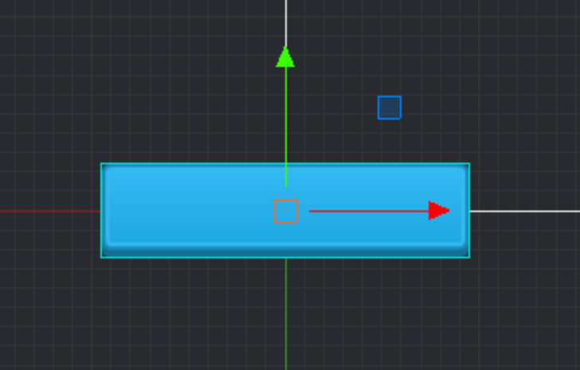

Alright, we will need a cool GUI script to control our cool box. But before that, let's check `input/game.input_binding` in the Defold editor to see if we have the `touch` action set up correctly. If `touch` wasn't mapped like the screenshot below then you will need to add it.

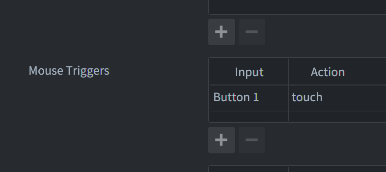

If you haven't inited hxDefold for our project yet, you can do it by running `haxelib run hxdefold init` in the directory of this project. Then in the `src` folder, we create `ButtonScript.hx`. For the sake of simplicity, let's call both "mouse" and "touch" as "pointer" and add the codes below. The comments will do the explaination.

```haxe
import defold.Go.GoMessages;
import defold.Gui;
import Defold.hash;
import defold.Msg;
import defold.support.GuiScript;
import defold.support.ScriptOnInputAction;
import defold.types.Hash;

class ButtonScript extends GuiScript<{}> {

    var bg_node:GuiNode;
    // If the pointer is inside the button.
    var pointer_over:Bool = false;
    // If the pointer is pressing down regardless if it's inside the button or not.
    var pointer_pressed:Bool = false;

    override function init(self:{}) {
        // This tells the engine that this script want to receive inputs.
        Msg.post('.', GoMessages.acquire_input_focus);

        bg_node = Gui.get_node("background");
    }

    override function on_input(self:{}, action_id:Hash, action:ScriptOnInputAction):Bool {
        if (action_id == hash("touch")) { // The pointer just pressed / released.
            if (action.pressed) {
                pointer_pressed = true;
                if (pointer_over)
                    // The pointer is inside the button and also pressed => the down state.
                    Gui.play_flipbook(bg_node, "down"); // Update the background to the correct sub-image.

            } if (action.released) {
                pointer_pressed = false;
                if (pointer_over)
                     // The pointer is inside the button but not pressed, means it's only hovering over out button.
                    Gui.play_flipbook(bg_node, "hover");
            }

        } if (action_id == null) { // The pointer just moved.
            if (pointer_over) { // If the state says the mouse / touch is inside the button
                if (!Gui.pick_node(bg_node, action.x, action.y)) { // but it is actually outisde
                    pointer_over = false; // then we update the state to be correct
                    Gui.play_flipbook(bg_node, "out"); // and update the background.
                }
            } else { // If the state says the pointer is outside the button
                if (Gui.pick_node(bg_node, action.x, action.y)) { // but this say "no"
                    pointer_over = true; // then we listen to it
                    // and update the background based on if the pointer is being pressed or not.
                    Gui.play_flipbook(bg_node, pointer_pressed ? "down" : "hover");
                }
            }
        }

        // If return true, the input will be consumed and therefor won't be passed onto other scripts if they weren't already called.
        return false;
    }

}
```

Run `haxe build.hxml` in the project directory to build our Haxe (into `main.lua` & `scripts/ButtonScript.gui_script`). Open `main\button.gui` in the Defold editor and set our script for the GUI.

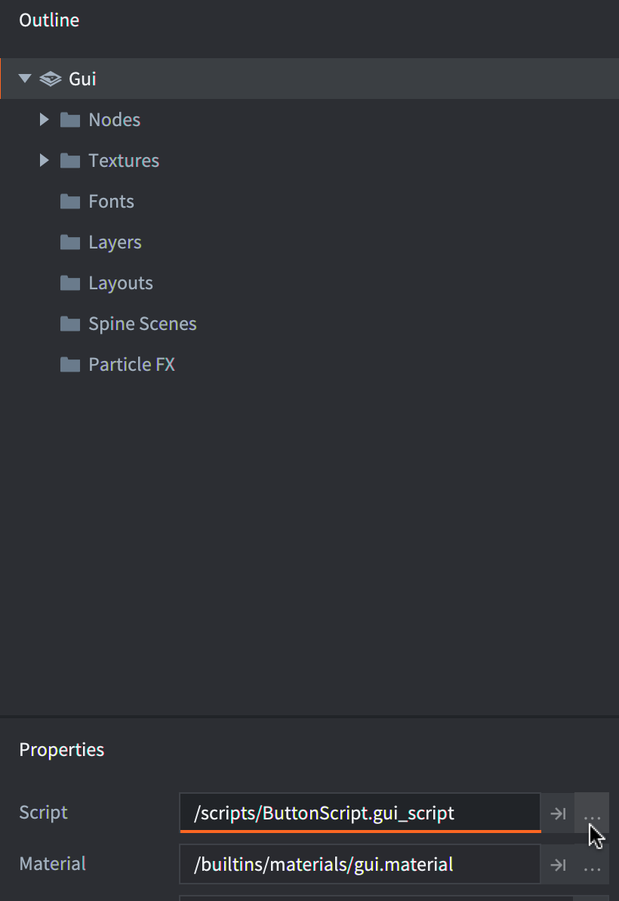

To have the button in our "game", we need to add it to the bootstrap `main/main.collection`. But GUI is a component type so first we need to add it to a game object then add `button.gui` to that object. In `main/main.collection`, right click `Collection` and select `Add Game Object`.

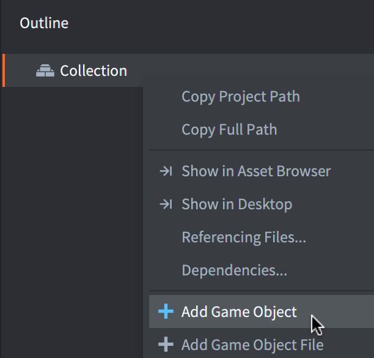

Then right click the just created `go` > `Add Component File`, select `button.gui`.

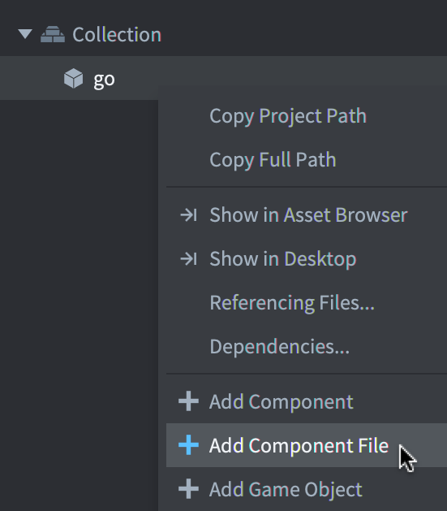

You may notice that the button is at the bottom left of the game viewport, it's because GUI uses that corner as the (0, 0) position.

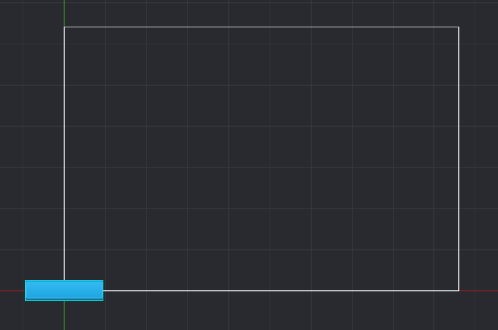

We need to drag the button to be completely inside the viewport but dragging the go won't do anything because game objects and GUI objects use different coordinates. Although our button is a component of the go, their positions aren't linked in anyway. So we need to drag the `background` node instead.

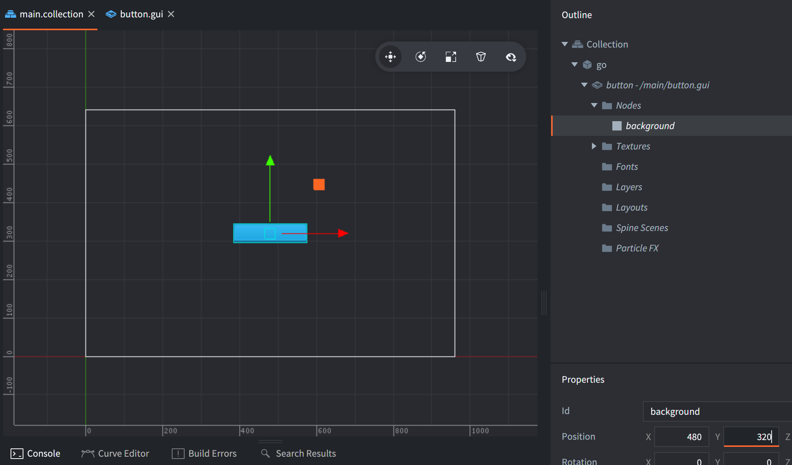

After dragging the node in `main.collection`, if you check `main/button.gui` you will see that the position of `background` was also updated there.

Now we build our project in the Defold editor (`Project` > `Build` or `Cmd+B` on Mac). Finally, some button interaction!

But there is something missing... A label! We go back to `button.gui` and add a text node as a child of `background`, name it `label`.

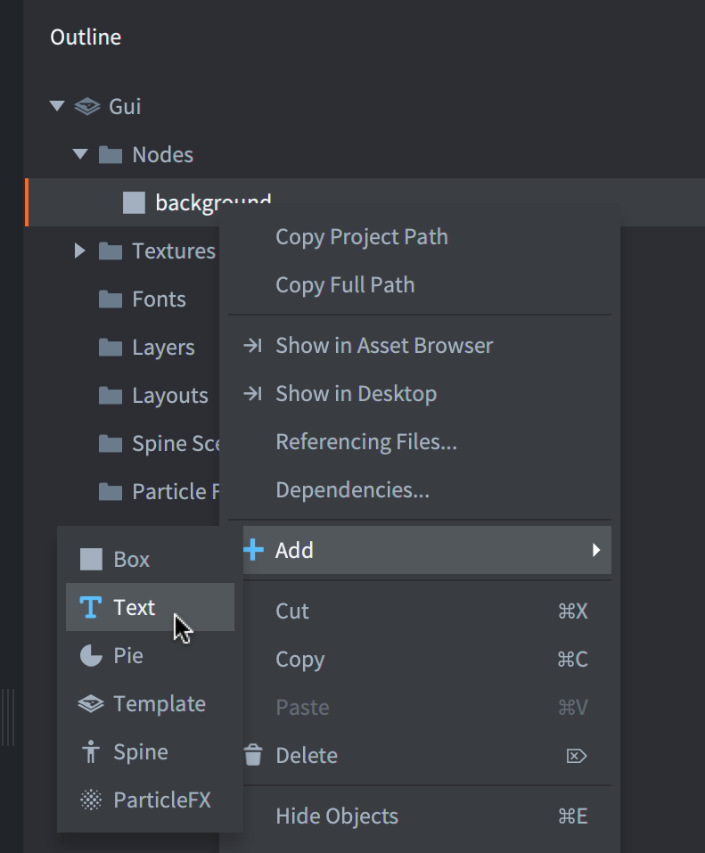

Our `label` will look pretty concerning because its font is missing.

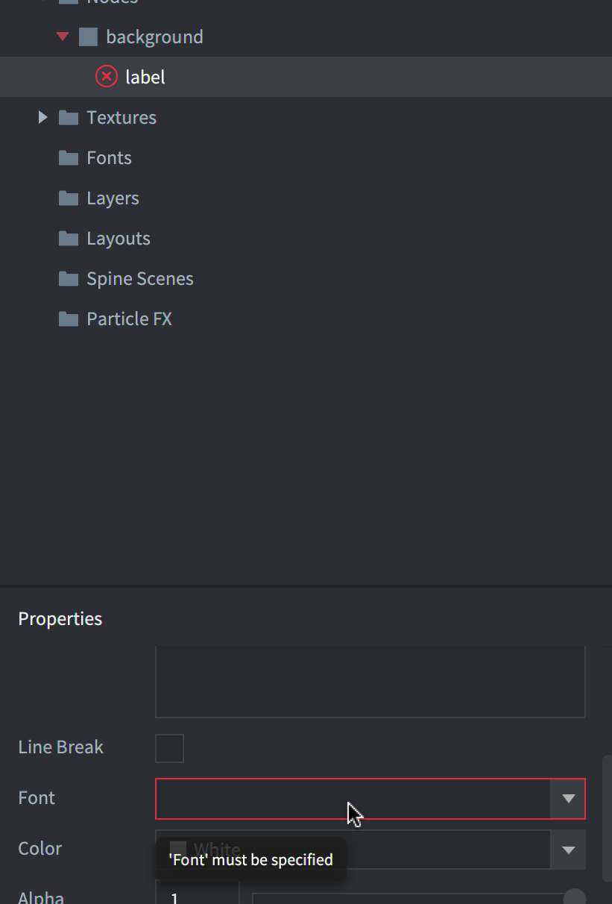

Alright, we know what we need to do.

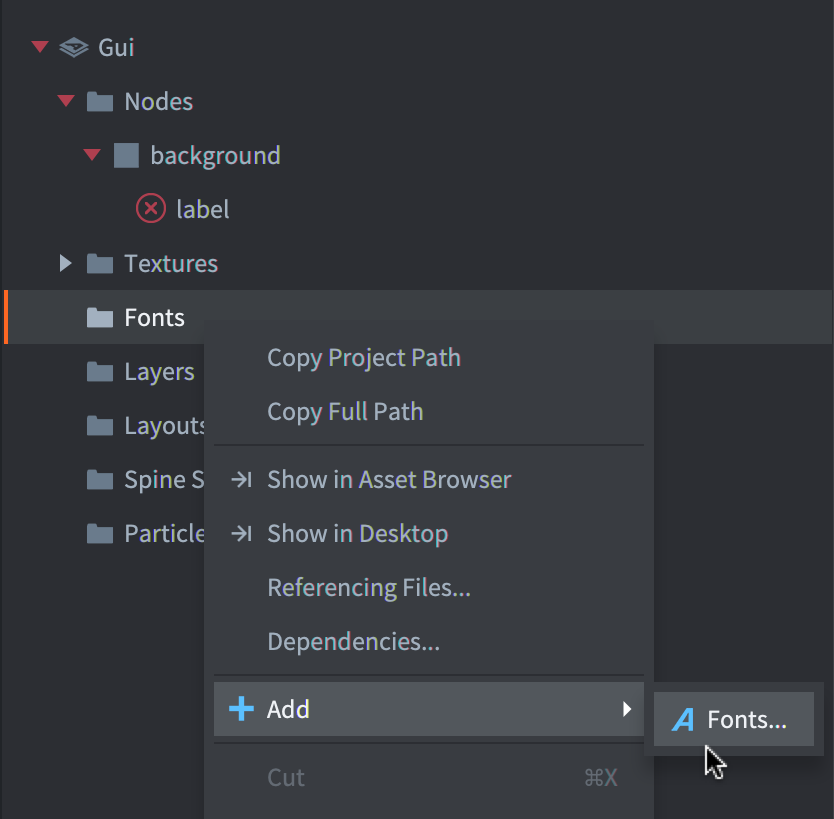

There will be only one font showing up named `system_font` which is a built-in font, select it and set it for our `label`. All the scary red things should disappear now and you can set the text to something like "PLEASE CLICK ME".

Let lay down some rules: a click/tap happens when the pointer was pressed inside a button then also released in that same button. We will now go back to our Haxe script to add handling of click/tap to our button. Let's pay attention to the newly added `click_inited`.

