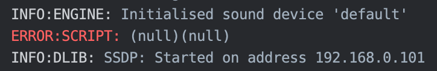
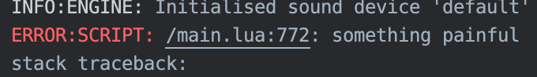
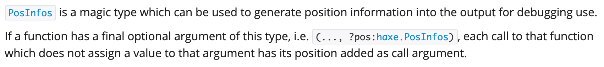
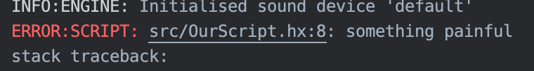

# Display Haxe errors in the Defold console

Using Haxe with Defold is great but you may encounter an issue in which `throw` doesn't work properly. Let's try this example:

```haxe
class OurScript extends defold.support.Script<{}> {

    override function init(self:{}) {
        throw "something painful";
    }

}
```

Running the script will cause an error as expected but the only info we get is `(null)(null)`.



That is not good, debugging `(null)(null)` is bound to cause some loss of sanity. We need to show more infos of our Haxe error. What if we replace `throw "something painful"` with `lua.Lua.error("something painful")`? The message will now show but the position will be from the generated Lua instead of Haxe.



Thankfully it is easy to create a method that has access to the position of each of its calls by using [`haxe.PosInfos`](https://api.haxe.org/haxe/PosInfos.html).




```haxe
class OurScript extends defold.support.Script<{}> {

    public static function error(message:String, ?level:Int = 0, ?infos:haxe.PosInfos):Void {
        // Paths in this format 'path/file_name:line_number' will be clickable in the Defold console.
        lua.Lua.error(infos.fileName + ':' + infos.lineNumber + ": " + message, level);
    }

    override function init(self:{}) {
        error("something painful");
    }

}
```

Now the error will show in the Defold console along with its position in Haxe. Clicking on the position will open the file in Defold and show the line where the error was generated.



Of course we are still far from the ideal place: `throw` still doesn't work so we may still have to deal with `(null)(null)` from external libraries and stacktraces are still from generated Lua positions. But let's welcome this a baby step and celebrate the fact that we have made progress, and that together we will make more progress travelling farther into the magical realms of Haxe and Defold, hopefully for one day getting to where `throw` works properly.

Happy Haxing & Defolding!